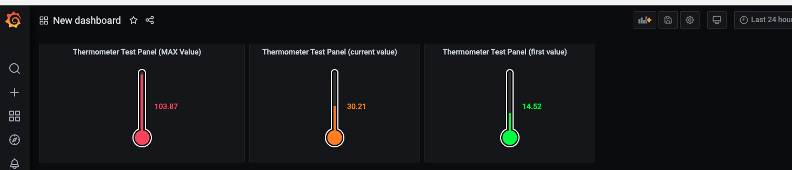
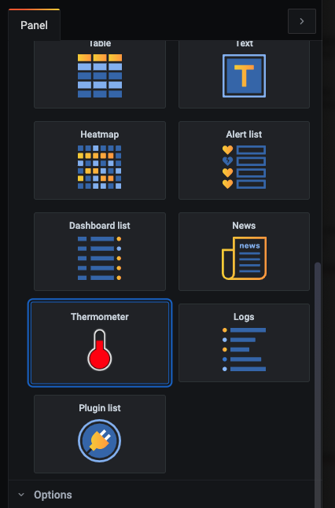
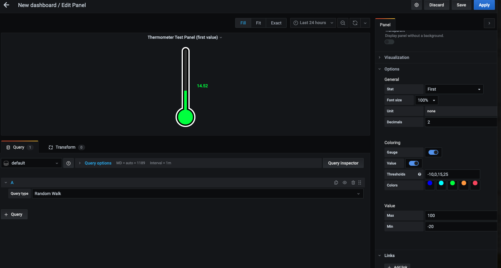
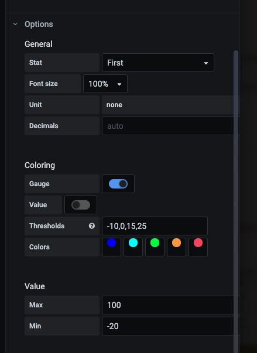

# Grafana Panel Plugin for Mercury Like Thermometer

This thermometer-panel is designed to display an analog"thermometer" in Grafana
It was based on the original grafana [piechart-panel](https://github.com/grafana/piechart-panel).

# Installation

```
git clone https://github.com/grapekh/grafana-thermometer-panel.git
sudo service grafana-server restart
```
Here are some example screen scrapes

Sample Dashboard:



Panel Visualizations:



Edit Panel Screen: 



Options Screen:




I wanted to get this working for grafana so that I could use it in my "weather station" from Home Assistant. 
Unfortunately, even though I got the code working, Home Assistant would not allow it to be used unless it was an 
"official" plugin.  therefore, I published it, and contributed it to grafana. 

Once that is working, I'll update and include Home Assistant instructions. 

### Releasing

This plugin uses [release-it](https://github.com/webpro/release-it) to release to GitHub.

```
env GITHUB_TOKEN=your_token yarn release-it patch
```

### Roadmap

- TODO: full annotation support
- TODO: better documentation
- release v1.0

#### Changelog


##### V1.0

- Works with Grafana 7.x and newer (naming fixed)
- Built and Tested with `@grafana/toolkit` 
- Tested locally on my MAC with yarn run v1.22.10 and grafana-toolkit core:start --watchTheme
- Validated on: INFO[10-22|10:17:58] - Starting Grafana logger=server version=7.4.0-pre commit=020dde53e4 branch=master compiled=2020-10-21T16:56:33-0400

##### V0.2

- Modified code base to get ready to work with Home Assistant as a plugin.   
- Prepared package and uploaded to githumfor initial release. 
- Removed latest security vulnerability (Bumped lodash from 4.0.1 to 4.17.20)
- Removed dependency on Gruntfile.js and modules

##### V0.1

- Original older code base found cloned and copied from piechart-panel and modifed extensively by an unknown author.  
- I Cleaned up code, fixed some bugs and removed other nastynesses.  Modified and made work for grafana V6.x and 7.x
